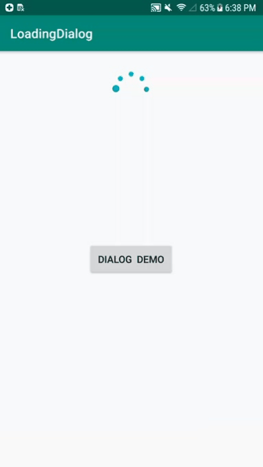

# LoadingView
Cool bezier loading view and dialog


A simple and cool beizer loading view and beizer loading dialog.


## DEMO


# USAGE


*Java*

 ```
 LoadingDialog dialog = LoadingDialog.get(this).show();

// later dismiss
dialog.hide()

```

*Kotlin*

```
 val dialog = LoadingDialog.get(this).show()

// later dismiss
dialog?.hide()

```


you can also add in XML 

```
<com.github.loadingview.LoadingView
        android:id="@+id/loadingView"
        android:layout_width="72dp"
        android:layout_height="72dp"
        android:layout_centerHorizontal="true"
        android:layout_gravity="center"
        android:layout_marginTop="24dp"
        app:lv_duration="2"
        app:lv_end_color="@color/color_end"
        app:lv_external_radius="24dp"
        app:lv_internal_radius="4dp"
        app:lv_start_color="@color/color_start" />
        
```

call in you activity to start loading

```
  loadingView.start()
  
  // for stop/hide 
  
  loadingView.stop()
```


##Attributes

|name|format|description|
|:---:|:---:|:---:|
| lv_external_radius | dimension |set external circle radius
| lv_internal_radius | dimension |set internal circle radius
| lv_duration | integer |set animation duration
| lv_start_color | color |set start color
| lv_end_color | color |set end color


# THANKS

Thanks to @JeasonWong
